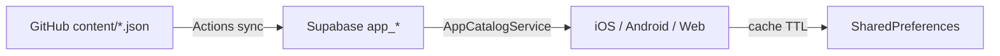

# Dinamik katalog (Supabase + GitHub) — Store sürümü

Play Store / App Store’a **bir kez** native uygulama yüklersin.  
Metin, liste, hastalık rehberi, haklar, forum kategorileri, kartlar ve ayarlar **Supabase**’ten gelir; uygulama açılışta çeker ve cache’ler.

Kod / UI değişince store güncellemesi gerekir. İçerik değişince **GitHub `content/` → Actions → Supabase** yeterli.

## Mimari

| Kaynak | Ne |
|--------|-----|
| `content/settings.json` | `show_demo_ilanlar`, TTL… |
| `content/diseases.json` | Ana sayfa hastalık rehberi |
| `content/categories_forum.json` | Forum chip’leri |
| `content/cards.json` | İletişim kartları (örnek: `cards.example.json`) |
| `content/rights.json` | Haklar (opsiyonel; SQL seed de var) |
| Supabase Table Editor | Elle hızlı düzenleme (trigger sürümü artırır) |

Flutter: `AppCatalogService` + `CatalogAdapters` — remote boşsa yerel `lib/data/*` fallback.

## Store’a ilk yükleme öncesi

1. Supabase SQL Editor → `supabase/app_catalog.sql` (ve haklar seed varsa `app_catalog_seed_rights.sql`)
2. GitHub repo Secrets:
   - `SUPABASE_URL`
   - `SUPABASE_SERVICE_ROLE_KEY` (service_role — sadece CI)
3. `content/` dosyalarını commit → `main`’e push → workflow `Sync catalog to Supabase` çalışır  
   veya elle:  
   `SUPABASE_URL=... SUPABASE_SERVICE_ROLE_KEY=... node tools/sync_catalog.mjs`
4. Uygulamada `show_demo_ilanlar: false` ile demo ilanlar kapalı
5. Play / App Store’a release build yükle

## İçerik güncelleme (store’suz)

1. `content/diseases.json` (veya diğer) düzenle  
   - Hastalık JSON yenilemek: `node tools/export_diseases_json.mjs`
2. Commit + push `main`
3. Actions sync → kullanıcılar bir sonraki açılış / TTL’de görür  
   (varsayılan TTL 6 saat; `catalog_ttl_hours` ile değişir)

## Fotoğraflar

- Şimdilik `assets/...` path’leri de çalışır (store paketinde gömülü)
- Yeni görsel için: Supabase Storage’a yükle → satırda `photo` / `media_url` = `https://...`  
  → store güncellemesi gerekmez (`CatalogImage` network destekler)

## Etkinlikler (AVM scraper) — katalog değil

`Sync catalog to Supabase` **Etkinlikler** sayfasını doldurmaz. Liste `public.etkinlikler` okur; AVM scraper ayrı workflow’dur.

1. Supabase SQL Editor → `supabase/events.sql` (mevcut etkinlikleri silmez)
2. GitHub secrets: `SUPABASE_URL`, `SUPABASE_SERVICE_ROLE_KEY`, `GEMINI_API_KEY`
3. GitHub → **Actions** → **Scrape AVM family events** (`scrape_events`) → **Run workflow**  
   Cron yalnızca **main**’de çalışır.

Yerel deneme: `python scripts/avm_scraper.py --max-sources 3`

## Store güncellemesi ne zaman gerekir?

- Yeni ekran / bug fix / native izin / paket bağımlılığı
- Yeni Dart alanı (adapter’ın bilmediği JSON şekli)
- Asset path’i pubspec’e yeni eklenen yerel dosya (URL kullanırsan gerekmez)

## Bağlı ekranlar

- Ana sayfa hastalıklar → `app_diseases`
- Haklar → `app_rights` / kategoriler
- Forum kategorileri → `app_categories` scope `forum`
- Kartlar → `app_content` scope `cards` (yoksa `kNeedCards`)
- İlan formu uzmanlık → scope `uzmanlik`
- Demo ilanlar → `app_settings.show_demo_ilanlar`
